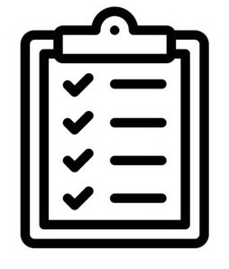

# ✅ Todo List App

A clean and minimal **To-Do List** web application built with vanilla HTML, CSS, and JavaScript — no frameworks.

---

## 📋 Features

- **Add tasks** — Type a task and hit "Add" to append it to your list
- **Complete tasks** — Click on a task to mark it as done (strikethrough + checked icon)
- **Delete tasks** — Click the `×` button on any task to remove it
- **Persistent storage** — Tasks are saved to `localStorage`, so they survive page refreshes and browser restarts

---

## 🧠 How It Works

| Action | Behavior |
|---|---|
| Type in the input box and click **Add** | Creates a new `<li>` element in the list |
| Click a **task** | Toggles the `checked` CSS class (strikethrough + icon swap) |
| Click the **× button** | Removes the task from the DOM |
| Any change | Saves the current list HTML to `localStorage` |
| Page load | Reads from `localStorage` and restores previous tasks |

---

## 🎨 Design

- Background: Deep navy-to-crimson gradient (`#16166B` → `#65000B`)
- Card: White, centered, max-width 540px with rounded corners
- Accent color: Rose/crimson (`#C21E56`) for the Add button
- Font: [Poppins](https://fonts.google.com/specimen/Poppins) (Google Fonts)
- Custom circular icons for checked/unchecked task states

---

## 🛠️ Built With

- **HTML5**
- **CSS3** (Flexbox, CSS pseudo-elements)
- **Vanilla JavaScript** (DOM manipulation, event delegation, `localStorage`)
